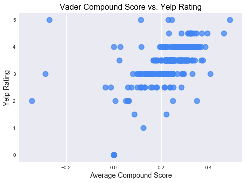
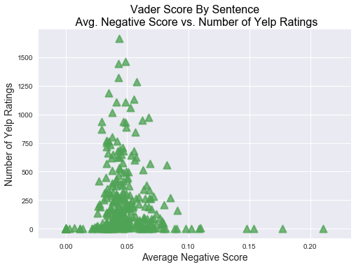

```python
import pandas as pd
import numpy as np
import matplotlib.pyplot as plt
from scipy import stats
import seaborn as sns
```


```python
yelp_df = pd.read_csv('yelp_review_analysis.csv',encoding='iso-8859-1')
yelp_df.head()
```


<div>
<table border="1" class="dataframe">
  <thead>
    <tr style="text-align: right;">
      <th></th>
      <th>compound</th>
      <th>compound_by_sent</th>
      <th>median_cmpd</th>
      <th>median_neg</th>
      <th>median_neu</th>
      <th>median_pos</th>
      <th>name</th>
      <th>negative</th>
      <th>negative_by_sent</th>
      <th>neutral</th>
      <th>...</th>
      <th>positive_by_sent</th>
      <th>range_cmpd_max</th>
      <th>range_cmpd_min</th>
      <th>range_neg_max</th>
      <th>range_neg_min</th>
      <th>range_neu_max</th>
      <th>range_neu_min</th>
      <th>range_pos_max</th>
      <th>range_pos_min</th>
      <th>rating</th>
    </tr>
  </thead>
  <tbody>
    <tr>
      <th>0</th>
      <td>0.1346</td>
      <td>0.0497</td>
      <td>0.0000</td>
      <td>0.000</td>
      <td>0.858</td>
      <td>0.000</td>
      <td>Max’s Restaurants</td>
      <td>0.0876</td>
      <td>0.1100</td>
      <td>0.8159</td>
      <td>...</td>
      <td>0.0783</td>
      <td>0.7269</td>
      <td>-0.4404</td>
      <td>1.00</td>
      <td>0.0</td>
      <td>1.0</td>
      <td>0.000</td>
      <td>0.357</td>
      <td>0.0</td>
      <td>3.0</td>
    </tr>
    <tr>
      <th>1</th>
      <td>0.0624</td>
      <td>0.0624</td>
      <td>0.0000</td>
      <td>0.061</td>
      <td>0.808</td>
      <td>0.115</td>
      <td>Franceschi’s</td>
      <td>0.0619</td>
      <td>0.0619</td>
      <td>0.8240</td>
      <td>...</td>
      <td>0.1142</td>
      <td>0.7050</td>
      <td>-0.4336</td>
      <td>0.15</td>
      <td>0.0</td>
      <td>1.0</td>
      <td>0.527</td>
      <td>0.343</td>
      <td>0.0</td>
      <td>2.0</td>
    </tr>
    <tr>
      <th>2</th>
      <td>0.2836</td>
      <td>0.2691</td>
      <td>0.3182</td>
      <td>0.000</td>
      <td>0.799</td>
      <td>0.149</td>
      <td>Butterfly Restaurant</td>
      <td>0.0483</td>
      <td>0.0429</td>
      <td>0.7384</td>
      <td>...</td>
      <td>0.1848</td>
      <td>0.9546</td>
      <td>-0.8377</td>
      <td>1.00</td>
      <td>0.0</td>
      <td>1.0</td>
      <td>0.000</td>
      <td>1.000</td>
      <td>0.0</td>
      <td>3.5</td>
    </tr>
    <tr>
      <th>3</th>
      <td>0.1785</td>
      <td>0.1455</td>
      <td>0.0000</td>
      <td>0.000</td>
      <td>0.811</td>
      <td>0.049</td>
      <td>La Terrasse</td>
      <td>0.0676</td>
      <td>0.0690</td>
      <td>0.7766</td>
      <td>...</td>
      <td>0.1410</td>
      <td>0.9523</td>
      <td>-0.9015</td>
      <td>1.00</td>
      <td>0.0</td>
      <td>1.0</td>
      <td>0.000</td>
      <td>1.000</td>
      <td>0.0</td>
      <td>2.5</td>
    </tr>
    <tr>
      <th>4</th>
      <td>0.2955</td>
      <td>0.2688</td>
      <td>0.3818</td>
      <td>0.000</td>
      <td>0.814</td>
      <td>0.180</td>
      <td>Tita’s Restaurant</td>
      <td>0.0560</td>
      <td>0.0585</td>
      <td>0.7835</td>
      <td>...</td>
      <td>0.1470</td>
      <td>0.8550</td>
      <td>-0.3818</td>
      <td>1.00</td>
      <td>0.0</td>
      <td>1.0</td>
      <td>0.000</td>
      <td>0.610</td>
      <td>0.0</td>
      <td>3.0</td>
    </tr>
  </tbody>
</table>
<p>5 rows × 23 columns</p>
</div>


```python
len(yelp_df[yelp_df['compound'] > 0])
```


    271


```python
len(yelp_df[yelp_df['rating'] == 4.0])
```


    69


```python
len(yelp_df[yelp_df['num_reviews']>0])
```


    277


```python
max(yelp_df['negative'])
```


    0.21079999999999999


```python
min(yelp_df['negative'])
```


    0.0


```python
fig = plt.figure()

#scatter plot1 compound score vs. yelp restaurant rating

plt.scatter(yelp_df['compound'], yelp_df['rating'], s=100, linewidths=2, alpha=0.75, color="#4286f4")
plt.xlabel('Avgerage Compound Score')
plt.ylabel('Rating')
plt.title('Vader Compound Score vs. Yelp Rating')
sns.set()
plt.show()
```


```python

#scatter plot2 negative score vs. yelp restaurant rating

plt.scatter(yelp_df['negative'], yelp_df['rating'], s=100, linewidths=2, alpha=0.75, color="#4fa355")
plt.xlabel('Average Negative Score')
plt.ylabel('Rating')
plt.title('Vader Positive Score vs. Yelp Rating')
sns.set()
plt.show()
```


```python
#scatter plot3 positive score vs. yelp restaurant rating

plt.scatter(yelp_df['positive'], yelp_df['rating'], s=100, linewidths=2, alpha=0.75, color="#8654a3")
plt.xlabel('Average Positive Score')
plt.ylabel('Rating')
plt.title('Vader Positive Score vs. Yelp Rating')
sns.set()
plt.show()
```





```python
## number of restrau having reviews out of total restraunt population
fig = plt.figure(figsize=(8, 8))
portions = [len(yelp_df[yelp_df['num_reviews']>0]), len(yelp_df[yelp_df['num_reviews']<1])]
colors = ['#f29232', '#b7b6b5']
labels = ['Rest_w/reviews', 'Rest_w/o reviews']
plt.pie(portions, labels=labels, autopct='%1.1f%%', shadow=True, colors = colors)
plt.axis('equal')
plt.title('Percent of Restaurants with Reviews')
plt.show()
```


```python
## Restaunts rating distribution

def my_autopct(pct):
    return ('%.2f%%' % pct) if pct >= 5 else ''

fig = plt.figure(figsize=(8, 8))
portions = yelp_df.groupby('rating')['rating'].count()
colors = ["#c0c0e0","#ece7f2","#d0d1e6","#a6bddb","#74a9cf","#3690c0","#0570b0","#045a8d","#023858", "#606080","#404060", "#604060"]
labels = portions.index
plt.pie(portions, colors=colors, labels=labels, startangle=90, radius=1.2, autopct=my_autopct)
porcent = 100.*portions/portions.sum()

plt.axis('equal')
plt.title('Restaurants with Reviews by Yelp Rating', y=1.05)
fig.tight_layout()
plt.show()
```


```python
# compound_by_sent vs  median compound score
plt.figure()

plt.scatter(yelp_df['compound_by_sent'], yelp_df['median_cmpd'], s=100, linewidths=2, alpha=0.75, color='#f1cb31', marker="^")
plt.xlabel('Average Compound Score')
plt.ylabel('Median Compound Score')
plt.title('Vader Score by Sentence Per Restaurant\n Avg. Compound Score vs. Median Compound Score')
sns.set()
plt.show()
```


```python
# compound_by_sent vs ratings
plt.scatter(yelp_df['compound_by_sent'], yelp_df['rating'], s=100, linewidths=2, alpha=0.75, color='#4286f4', marker="^")
plt.xlabel('Average Compound Score')
plt.ylabel('Yelp Rating')
plt.title('Vader Score by Sentence Per Restaurant\n Avg. Compound Score vs. Yelp Rating')
sns.set()
plt.show()
```


```python
#negative score by sentence vs number of reviews
plt.scatter(yelp_df['negative_by_sent'], yelp_df['num_reviews'], s=100, linewidths=2, alpha=0.75, color='#4fa355', marker="^")
plt.xlabel('Average Negative Score')
plt.ylabel('Number of Yelp Ratings')
plt.title('Vader Score by Sentence Per Restaurant\n Avg. Negative Score vs. Number of Yelp Ratings')
sns.set()
plt.show()
# does not matter the number of reviews, the negative scorer for most restaurants ranges frm 0-0.10
```





```python
#calculating correlation between negative score and number of reviews
corr = numpy.corrcoef(yelp_df['negative_by_sent'], yelp_df['num_reviews'])[0,1]
corr
```


    0.036960579892247603


```python
#calculating correlation and p-value
negscore_corr = stats.pearsonr(yelp_df['negative_by_sent'], yelp_df['num_reviews'])
negscore_corr
#the output above suggests - the correlation between negative score and number of reviews of restaurant is only 0.03 which means there is no strong correlation. To top that, the -pvalue is 0.52 ( pvalue>0.5) which means correlation is not significant
```


    (0.036960579892247575, 0.52365502945134201)


```python
#pos_range_max vs num of reviews --> to see if numb of reviews are less, it skews the sentiment scores
plt.scatter(yelp_df['range_pos_max'], yelp_df['num_reviews'],  s=100, linewidths=2, alpha=0.75, color='#40b5b7', marker='s')
plt.xlabel('Max Vader Positive Score')
plt.ylabel('Number of Yelp Reviews')
plt.title('Max Vader Positive Score vs. Number of Yelp Reviews')
sns.set()
plt.show()
#the graph below shows that lesser the reviews (less than 100) have less max pos_score (<1)
## not important inference
```


```python
#calculating pearson correlation
maxpos_corr = stats.pearsonr(yelp_df['range_pos_max'], yelp_df['num_reviews'])
maxpos_corr

# the low p-value suggests that thre is high probabilty data represents hypothesis, 
#but since correlatin value is too low, only 0.39, its a positive but not so strong correlation.
```


    (0.39782635452407639, 8.0994882554057922e-13)


```python
#pos_by_sent vs ratings
plt.scatter( yelp_df['rating'], yelp_df['positive_by_sent'],  s=100, linewidths=2, alpha=0.75, color='#d385ce', marker='s')
plt.xlabel('Yelp Rating')
plt.ylabel('Avg Positive Score')
plt.title('Vader Positive Score vs. Yelp Rating')
sns.set()
plt.show()
#the chart below shows that even though restrs have low positive score it does not affect the ratings
```


```python
#calculating pearson correlation
pos_corr = stats.pearsonr(yelp_df['positive_by_sent'], yelp_df['rating'])
pos_corr

#there is a high correlation between positive score and ratings of a restaurant.
#also p-value is <0.1, which shows the relation is highly significant
#this means -  positive review score can help build the good ratings(stars) for a restraurant
```


    (0.80155698780920925, 1.5813200908265016e-68)


```python
#calculating pearson correlation
neg_corr = stats.pearsonr(yelp_df['negative_by_sent'], yelp_df['rating'])
neg_corr1 = np.corrcoef(yelp_df['negative_by_sent'], yelp_df['rating'])[-1,0]
neg_corr

# there is no high correlation between negative score of reviews and restraurant ratings.just positive 0.31
#the relation is significant as p-value is <0.1, but correlation is not so strong. 
#this does not prove negative review score and restraunt rating means high/low restraunt ratings
```


    (0.31423972044151272, 2.6733675572134901e-08)


```python
#calculating pearson correlation
reviews_corr = stats.pearsonr(yelp_df['num_reviews'], yelp_df['rating'])
reviews_corr1 = np.corrcoef(yelp_df['num_reviews'], yelp_df['rating'])[-1,0]
reviews_corr1
```


    0.22358315662138933


```python

```
